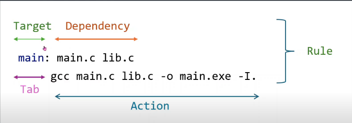

# Ví dụ về các Rule cơ bản trong Makefile



## Giới thiệu

Đây là một ví dụ đơn giản để minh họa cách sử dụng các rule cơ bản trong Makefile. Project này bao gồm một chương trình C đơn giản với các file nguồn được tách thành nhiều module.

## Cấu trúc thư mục

- `main.c`: File chứa hàm main chính của chương trình
- `lib.h`: File header chứa khai báo hàm
- `lib.c`: File nguồn chứa định nghĩa hàm
- `Makefile`: File chứa các rule để biên dịch project

## Chức năng các file

1. **main.c**

   - Chứa hàm main
   - Gọi hàm mfunction() từ thư viện lib
   - In ra chuỗi "Hello"

2. **lib.h & lib.c**
   - Định nghĩa và cài đặt hàm mfunction()
   - Khi được gọi sẽ in ra chuỗi "mFunction"

## Cấu trúc Makefile

Makefile trong project này có 4 rule chính:

1. **Rule biên dịch main.o**

   ```makefile
   main.o: main.c
       gcc -c main.c -o main.o
   ```

2. **Rule biên dịch lib.o**

   ```makefile
   lib.o: lib.c
       gcc -c lib.c -o lib.o
   ```

3. **Rule all**

   ```makefile
   all: main.o lib.o
       gcc main.o lib.o -o main.exe
   ```

4. **Rule clean**

   ```makefile
   clean:
       rm -f *.exe *.o
   ```

## Cách sử dụng

1. Biên dịch toàn bộ project:

   ```bash
   make all
   ```

2. Chạy chương trình:

   ```bash
   ./main.exe # hoặc ./main.exe đều được
   ```

3. Dọn dẹp các file biên dịch:

   ```bash
   make clean
   ```

## Ưu điểm của Makefile

- Tự động hóa quá trình biên dịch
- Chỉ biên dịch lại những file đã thay đổi
- Giảm thời gian rebuild project
- Quản lý dependencies một cách hiệu quả
