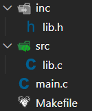

# Tìm Hiểu Về VPATH và CFLAGS trong Makefile

## Giới Thiệu

Trong bài học này, chúng ta sẽ tìm hiểu cách tổ chức và biên dịch một dự án C có cấu trúc thư mục phân tầng, sử dụng các biến đặc biệt VPATH và CFLAGS trong Makefile.

## Cấu Trúc Thư Mục

Dự án được tổ chức với cấu trúc thư mục như sau:

- `src/`: Chứa các file source code (.c)
- `inc/`: Chứa các file header (.h)
- `Makefile`: File cấu hình để build dự án
- `main.c`: File chương trình chính

## Giải Thích Về VPATH và CFLAGS

### VPATH (Variable Path)

- VPATH là một biến đặc biệt trong Makefile để chỉ định đường dẫn tìm kiếm các file source.
- Khi Makefile thực thi, nó sẽ tìm các file .c theo thứ tự:
  1. Trong thư mục hiện tại (root)
  2. Trong các thư mục được chỉ định bởi VPATH
- Cú pháp: `VPATH = src`

### CFLAGS (Compiler Flags)

- CFLAGS là các tùy chọn được truyền cho compiler (GCC)
- Trong trường hợp này, chúng ta sử dụng `-I` để chỉ định thư mục chứa file header
- Cú pháp: `CFLAGS = -I inc`
  - `-I inc`: Compiler sẽ tìm các file header trong thư mục `inc/`

## Cách Hoạt Động

1. Khi biên dịch, make sẽ tìm các file source (.c) trong thư mục `src/` (nhờ VPATH)
2. Compiler sẽ tìm các file header (.h) trong thư mục `inc/` (nhờ CFLAGS)
3. Quá trình biên dịch sẽ tạo ra các file object (.o) và file thực thi cuối cùng

## Ưu Điểm

- Tổ chức code rõ ràng, phân tầng
- Dễ dàng quản lý và bảo trì code
- Tách biệt giữa interface (header) và implementation (source)
