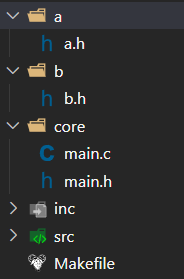

# Sử dụng foreach trong Makefile

Trong quá trình phát triển một dự án lớn, chúng ta thường gặp trường hợp có nhiều thư mục chứa các file mã nguồn (.c) hoặc file header (.h). Việc liệt kê thủ công tất cả các file này trong Makefile sẽ rất tốn thời gian và khó bảo trì. Đây chính là lúc chúng ta cần sử dụng hàm `foreach` trong Makefile.

## Cấu trúc thư mục của dự án mẫu



Như trong hình, dự án của chúng ta có cấu trúc phân chia rõ ràng:

- Thư mục `src`: chứa các file mã nguồn (.c)
- Thư mục `inc`: chứa các file header chính
- Thư mục `core`: chứa file main và các thành phần core của chương trình
- Thư mục `a` và `b`: chứa các file header phụ trợ

## Cú pháp của foreach

```makefile
$(foreach var, list, text)
```

Trong đó:

- `var`: là biến tạm thời, được sử dụng để lưu trữ từng phần tử trong list khi vòng lặp thực thi
- `list`: là danh sách các phần tử mà chúng ta muốn duyệt qua
- `text`: là biểu thức hoặc câu lệnh sẽ được thực hiện với mỗi phần tử trong list

## Ứng dụng trong dự án

Foreach thường được sử dụng để:

1. Thu thập tất cả các file nguồn từ nhiều thư mục khác nhau
2. Thêm các đường dẫn include cho compiler
3. Tự động tạo danh sách các object files
4. Xử lý dependencies một cách tự động

Ví dụ để thu thập tất cả file .c trong dự án:

```makefile
SRC_DIRS = src core
SRCS = $(foreach dir, $(SRC_DIRS), $(wildcard $(dir)/*.c))
```
